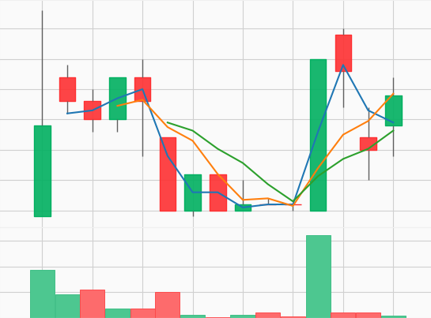

# cnn_price_prediction

### 1. Pulls data from the coinbase API
### 2. Reformats data into pandas dataframe
### 3. Creates Images of candlestick charts of 15 minutes at 1 minute granularity
### 4. Train and validation randomly split at 90/10 from total images created
### 5. Uses CNN to determine if next 15 minute image will have a higher or lower closing price

